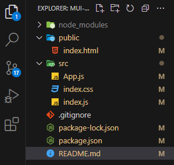
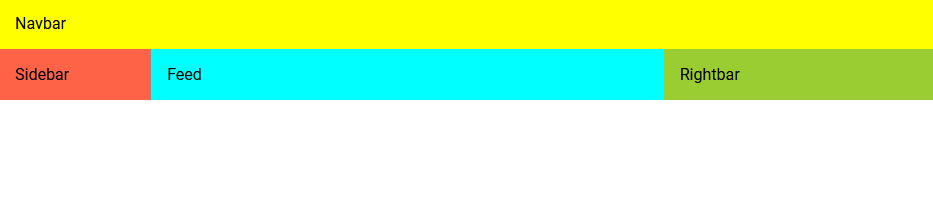
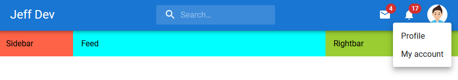

# Social-media demo with Material UI & React JS  
updated from other guy..  updated...


Social Media Demo App with Material UI and React JS

## 0110 Project Setup

### Inital Setup

To create React app  
To setup Material UI with icons

```
// React
npx create-react-app .

// Material UI
npm install @mui/material @emotion/react @emotion/styled

// Material UI Icons
npm install @mui/icons-material
```

To setup Roboto font

```javascript
// [public/index.html]

<link rel="preconnect" href="https://fonts.googleapis.com" />
<link rel="preconnect" href="https://fonts.gstatic.com" crossorigin />
<link
  rel="stylesheet"
  href="https://fonts.googleapis.com/css2?family=Roboto:wght@100;200;300;400;500;600;700&display=swap"
/>
<style>
  * {
    margin: 0;
    font-family: "Roboto", serif;
  }
</style>

```

### Project Inital Cleanup

To delete redandancy or unnecessary files

```
// Delete files except the followings

public  / index.html
src     / App.js
          index.css
          index.js
```

> Folder strcture after cleanup  
> 

To edit files with only necessary contents

```javascript
// [public/index.html]

<!DOCTYPE html>
<html lang="en">
  <head>
    <meta charset="utf-8" />
    <meta name="viewport" content="width=device-width, initial-scale=1" />
    <meta
      name="description"
      content="Web site created using create-react-app"
    />
    <link rel="preconnect" href="https://fonts.googleapis.com" />
    <link rel="preconnect" href="https://fonts.gstatic.com" crossorigin />
    <link
      rel="stylesheet"
      href="https://fonts.googleapis.com/css2?family=Roboto:wght@100;200;300;400;500;600;700&display=swap"
    />
    <style>
      * {
        margin: 0;
        font-family: "Roboto", serif;
      }
    </style>
    <title>React App</title>
  </head>
  <body>
    <noscript>You need to enable JavaScript to run this app.</noscript>
    <div id="root"></div>
  </body>
</html>


// [src/App.js]

function App() {
  return <div>App</div>;
}

export default App;


// [src/index.js]

import React from "react";
import ReactDOM from "react-dom/client";
import "./index.css";
import App from "./App";

const root = ReactDOM.createRoot(document.getElementById("root"));
root.render(
  <React.StrictMode>
    <App />
  </React.StrictMode>
);


// [src.index.css]

body {
  -webkit-font-smoothing: antialiased;
  -moz-osx-font-smoothing: grayscale;
}
```

## 0210 Material UI Basic Intro

### Component source (from)

When you import Meterial components, most of them are from <b><span style="color:orange">@mui/material</span></b>.

### sx (prop)

sx is a prop of Material UI components.  
In sx, you may write the CSS directly.

```javascript
// Careful : import from "@mui/material"

import { Box, Button } from "@mui/material";

function App() {
  return (
    <Box>
      <Button
        variant="contained"
        sx={{
          background: "tomato",
          color: "yellowgreen",
          margin: 2, // 2 * 8px = 16px
          "&:hover": {
            background: "orange",
          },
          "&:disabled": {
            background: "grey",
            color: "#111",
          },
        }}
      >
        My button
      </Button>
    </Box>
  );
}

export default App;
```

> \* **In css**

```
.classA.classB => <div class="classA, classB">~~</div>
.classA .classB => <div class="classA"><div class="classB">~~</div><div>
```

> \* **& of scss**  
>  & : parent selector of scss

```javascript
// scss
.button {
  &:visited { }
  &:hover { }
  &:active { }
}

// css compiled from upper scss
  .button:visited { }
  .button:hover { }
  .button:active { }
```

### Custom component

styled() method(from "@mui/material") can custimize components.

```javascript
import { Box, Button, styled } from "@mui/material";

function App() {
  const MyButton = styled(Button)({
    background: "tomato",
    color: "yellowgreen",
    margin: 2, // 2 * 8px = 16px
    "&:hover": {
      background: "orange",
    },
    "&:disabled": {
      background: "grey",
      color: "#111",
    },
  });
  return (
    <Box>
      <MyButton variant="contained">My button</MyButton>
      <MyButton variant="contained" disabled>
        My button
      </MyButton>
    </Box>
  );
}

export default App;
```

### Custom theme

Default Theme of Material UI

> https://mui.com/material-ui/customization/default-theme/

To customize theme

- To defined a customized theme in theme.js
- To apply the theme in root side file such as index.js

```javascript
// [src/theme.js]

import { createTheme } from "@mui/material";
...

export const theme = createTheme({
  palette: {
    primary: {
      main: "#d50000",
      light: "skyblue",
    },
    secondary: {
      main: "#15c630",
    },
    otherColor: {
      main: "#a1a1a1",
    },
  },
});

// {src/index.js}

import React from "react";
import ReactDOM from "react-dom/client";
import "./index.css";
import App from "./App";
import { ThemeProvider } from "@mui/material";
import { theme } from "./theme";

const root = ReactDOM.createRoot(document.getElementById("root"));
root.render(
  <React.StrictMode>
    <ThemeProvider theme={theme}>
      <App />
    </ThemeProvider>
  </React.StrictMode>
);
```

You may apply the theme in the customized component.

```javascript
import { Box, styled } from "@mui/material";
import Button from "@mui/material/Button";
import { theme } from "./theme";

function App() {
  const MyButton = styled(Button)(({ theme }) => ({
    background: theme.palette.otherColor.main,
    color: "yellowgreen",
    margin: 2, // 2 * 8px = 16px
    "&:hover": {
      background: "orange",
    },
    "&:disabled": {
      background: "grey",
      color: "#111",
    },
  }));
  return (
    ...
  );
}

export default App;

```

## 0310 Layout & Responsive design

### Basic Layout

Layout components

- Box : Similar to <div>
- Container : Similar to Box, but content is positioned to the center
- Grid : 2-dimentional layouts
- Stack : 1-dimentional layouts : direction="column" or row

> **Material UI default breakpoints**

    - xs, extra-small: 0px
    - sm, small: 600px
    - md, medium: 900px
    - lg, large: 1200px
    - xl, extra-large: 1536px

Basic layout example

```javascript
// [src/App.js] ----------

...

function App() {
  return (
    <Box>
      <Navbar />
      <Stack direction={"row"}>
        <Sidebar />
        <Feed />
        <Rightbar />
      </Stack>
    </Box>
  );
}

export default App;

// [components/Navbar.js] ----------
...

const Navbar = () => {
  return <Box sx={{ background: "yellow", padding: 2 }}>Navbar</Box>;
};

export default Navbar;

// [components/Sidebar.js] ----------
...

const Sidebar = () => {
  return (
    <Box
      sx={{
        background: "tomato",
        flex: 1,
        display: { xs: "none", sm: "block" },
        padding: 2,
      }}
    >
      Sidebar
    </Box>
  );
};

export default Sidebar;

// [components/Feed.js] ----------
...

const Feed = () => {
  return <Box sx={{ background: "cyan", flex: 4, padding: 2 }}>Feed</Box>;
};

export default Feed;

// [components/Rightbar.js] ----------
...

const Rightbar = () => {
  return (
    <Box
      sx={{
        background: "yellowgreen",
        flex: 2,
        display: { xs: "none", sm: "block" },
        padding: 2,
      }}
    >
      Rightbar
    </Box>
  );
};

export default Rightbar;
```

Upper UI outlook  


### Basic Layout : Appbar

Appbar with search box, notications, and user

```javascript
...

const StyledToolbar = styled(Toolbar)({
  display: "flex",
  justifyContent: "space-between",
});

const Search = styled("div")(({ theme }) => ({
  position: "relative",
  borderRadius: theme.shape.borderRadius,
  backgroundColor: alpha(theme.palette.common.white, 0.15),
  "&:hover": {
    backgroundColor: alpha(theme.palette.common.white, 0.25),
  },
  margin: "0 16px",
  width: "100%",
  [theme.breakpoints.up("sm")]: {
    marginLeft: theme.spacing(3),
    width: "auto",
  },
}));

// Search section
const SearchIconWrapper = styled("div")(({ theme }) => ({
  padding: theme.spacing(0, 2),
  height: "100%",
  position: "absolute",
  pointerEvents: "none",
  display: "flex",
  alignItems: "center",
  justifyContent: "center",
}));

const StyledInputBase = styled(InputBase)(({ theme }) => ({
  color: "inherit",
  "& .MuiInputBase-input": {
    padding: theme.spacing(1, 1, 1, 0),
    // vertical padding + font size from searchIcon
    paddingLeft: `calc(1em + ${theme.spacing(4)})`,
    transition: theme.transitions.create("width"),
    width: "100%",
    [theme.breakpoints.up("md")]: {
      width: "20ch",
    },
  },
}));

const Navbar = () => {
  const [anchorEl, setAnchorEl] = React.useState(null);
  const [mobileMoreAnchorEl, setMobileMoreAnchorEl] = React.useState(null);
  const isMenuOpen = Boolean(anchorEl);
  const isMobileMenuOpen = Boolean(mobileMoreAnchorEl);
  const handleProfileMenuOpen = (event) => {setAnchorEl(event.currentTarget);};
  const handleMobileMenuClose = () => {setMobileMoreAnchorEl(null);};
  const handleMenuClose = () => {
    setAnchorEl(null);
    handleMobileMenuClose();
  };

  const handleMobileMenuOpen = (event) => {
    setMobileMoreAnchorEl(event.currentTarget);
  };

  const menuId = "primary-search-account-menu";
  const renderMenu = (
    <Menu
      anchorEl={anchorEl}
      anchorOrigin={{
        vertical: "top",
        horizontal: "right",
      }}
      sx={{ marginTop: "32px" }}
      id={menuId}
      keepMounted
      transformOrigin={{
        vertical: "top",
        horizontal: "right",
      }}
      open={isMenuOpen}
      onClose={handleMenuClose}
    >
      <MenuItem onClick={handleMenuClose}>Profile</MenuItem>
      <MenuItem onClick={handleMenuClose}>My account</MenuItem>
    </Menu>
  );

  const mobileMenuId = "primary-search-account-menu-mobile";
  const renderMobileMenu = (
    <Menu
      anchorEl={mobileMoreAnchorEl}
      anchorOrigin={{
        vertical: "top",
        horizontal: "right",
      }}
      sx={{ marginTop: "32px" }}
      id={mobileMenuId}
      keepMounted
      transformOrigin={{
        vertical: "top",
        horizontal: "right",
      }}
      open={isMobileMenuOpen}
      onClose={handleMobileMenuClose}
    >
      <MenuItem>
        <IconButton size="large" aria-label="show 4 new mails" color="inherit">
          <Badge badgeContent={4} color="error">
            <Mail />
          </Badge>
        </IconButton>
        <p>Messages</p>
      </MenuItem>
      <MenuItem>
        <IconButton
          size="large"
          aria-label="show 17 new notifications"
          color="inherit"
        >
          <Badge badgeContent={17} color="error">
            <Notifications />
          </Badge>
        </IconButton>
        <p>Notifications</p>
      </MenuItem>
      <MenuItem onClick={handleProfileMenuOpen}>
        <IconButton
          size="large"
          aria-label="account of current user"
          aria-controls="primary-search-account-menu"
          aria-haspopup="true"
          color="inherit"
        >
          <AccountCircle />
        </IconButton>
        <p>Profile</p>
      </MenuItem>
    </Menu>
  );
  return (
    <Box>
      <AppBar position="sticky">
        <StyledToolbar>
          <Box>
            <Typography
              variant="h5"
              sx={{ display: { xs: "none", sm: "block" } }}
            >
              Jeff Dev
            </Typography>
            <Layers
              sx={{
                display: { xs: "block", sm: "none" },
                fontSize: "2rem",
              }}
            />
          </Box>
          <Box>
            <Search>
              <SearchIconWrapper>
                <SearchIcon />
              </SearchIconWrapper>
              <StyledInputBase
                placeholder="Search…"
                inputProps={{ "aria-label": "search" }}
              />
            </Search>
          </Box>
          <Box>
            <Box sx={{ display: { xs: "none", md: "flex" } }}>
              <IconButton
                size="large"
                aria-label="show 4 new mails"
                color="inherit"
              >
                <Badge badgeContent={4} color="error">
                  <Mail />
                </Badge>
              </IconButton>
              <IconButton
                size="large"
                aria-label="show 17 new notifications"
                color="inherit"
              >
                <Badge badgeContent={17} color="error">
                  <Notifications />
                </Badge>
              </IconButton>
              <IconButton
                size="large"
                edge="end"
                aria-label="account of current user"
                aria-controls={menuId}
                aria-haspopup="true"
                onClick={handleProfileMenuOpen}
                color="inherit"
              >
                <Avatar alt="Remy Sharp" src="/user-png-64.png" />
              </IconButton>
            </Box>
            <Box
              sx={{ display: { xs: "flex", md: "none" }, marginLeft: "16px" }}
            >
              <IconButton
                size="large"
                aria-label="show more"
                aria-controls={mobileMenuId}
                aria-haspopup="true"
                onClick={handleMobileMenuOpen}
                color="inherit"
              >
                <MenuIcon sx={{ fontSize: "2rem" }} />
              </IconButton>
            </Box>
          </Box>
        </StyledToolbar>
      </AppBar>
      {renderMobileMenu}
      {renderMenu}
    </Box>
  );
};

export default Navbar;
```

Upper UI outlook



## Reference

Lama Dev  
https://www.youtube.com/watch?app=desktop&v=fzxEECHnsvU
